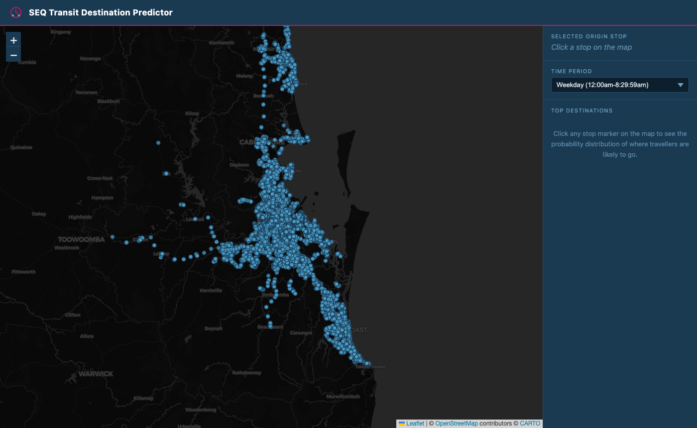
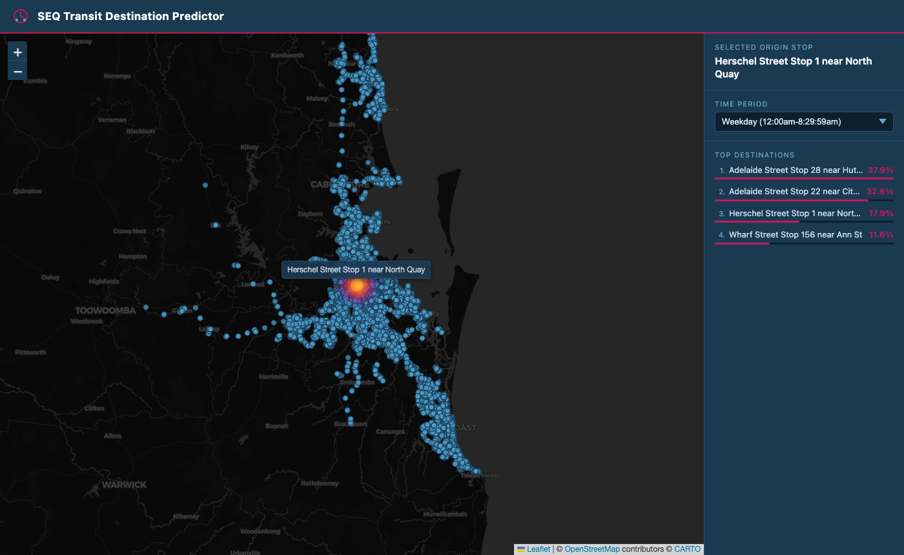
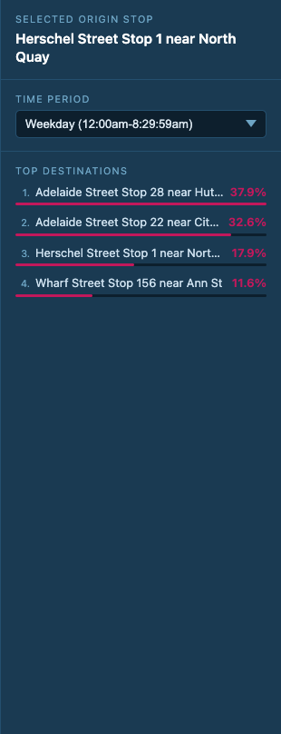

# SEQ Transit Destination Predictor

An interactive web app that shows where public transport passengers are likely to travel in South East Queensland. Pick any stop on the map, choose a time period, and a heatmap appears showing the probability distribution of where travellers from that stop will go — with the top 10 destinations ranked in the sidebar. The predictions are derived from six months of real Translink origin-destination trip data (October 2025 – March 2026).

## Screenshots

**Full SEQ map on load**


**Stop selected — heatmap and destination list**


**Sidebar detail — stop name, time period and top destinations**


## How it works

**Data source:** The app uses Translink's Origin-Destination trip dataset, which records every fare transaction as a pair of stops — the touch-on stop (origin) and the touch-off stop (destination). Six monthly CSV files are loaded at startup and aggregated into a single dataset covering over five million trip records.

**Prediction logic:** For each origin stop and time period, the app computes the probability that a passenger will travel to each destination stop: `P(dest | origin, time) = trips(origin → dest, time) / total_trips(origin, time)`. These probabilities are precomputed at startup so every click on the map returns an instant response. The heatmap intensity is scaled proportionally to probability, so the most likely destinations glow brightest.

## Getting started

### 1. Get the data

Download the following files and place them in the `data/` folder:

- **Translink OD trip CSVs** — the monthly Origin-Destination files from [data.qld.gov.au](https://www.data.qld.gov.au). The app expects files matching the pattern `*TL Org-Dest Trips.csv`.
- **GTFS stops.txt** — from the [Translink GTFS feed](https://www.data.qld.gov.au/dataset/general-transit-feed-specification-gtfs-seq). Rename or save the file as `data/stops.txt`.

Your `data/` folder should look like:
```
data/
├── stops.txt
├── 202510 (Oct) TL Org-Dest Trips.csv
├── 202511(Nov) TL Org-Dest Trips.csv
└── ...
```

### 2. Install dependencies

```bash
pip install -r requirements.txt
```

### 3. Run the app

```bash
uvicorn app.main:app --reload
```

Then open **http://localhost:8000** in your browser.

On first startup the backend loads and processes all CSV files — this takes around 30 seconds for six months of data. A loading spinner is shown in the browser while it completes.

## Data notes

The OD dataset records complete trip segments, not individual stops. Each record represents a single boarding event: the passenger touches on at the origin stop and touches off at the destination stop. Journeys involving transfers appear as separate records — one per vehicle boarded. The app models each segment independently, so the predictions reflect the most common next touch-off from any given stop.

Stops that appear in the trip data but are absent from `stops.txt` are silently skipped and will not appear on the map.

## Built with

- **Python** · FastAPI · pandas
- **JavaScript** · Leaflet.js · leaflet-heat
- **Data** · Translink Open Data (Queensland Government)
