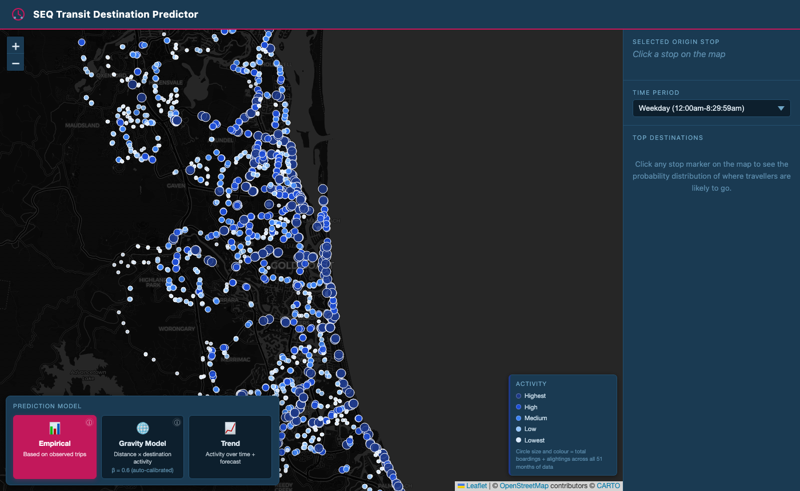
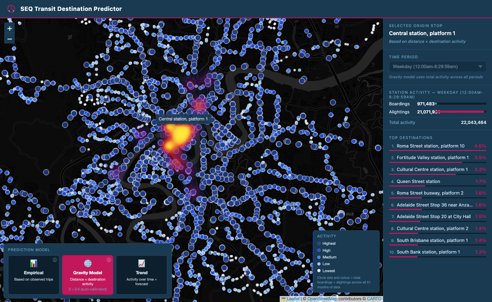
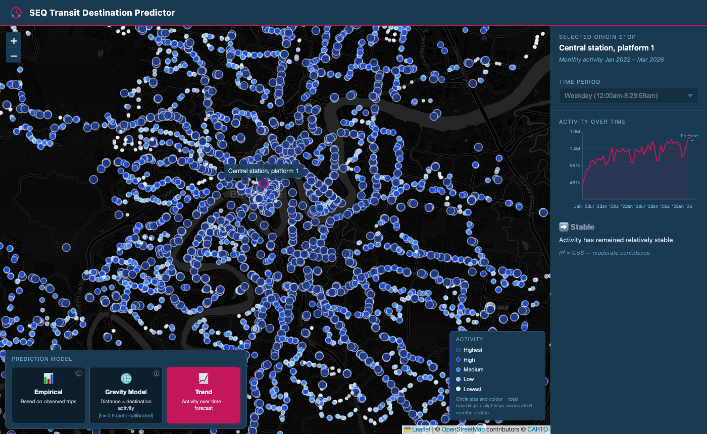

# SEQ Transit Destination Predictor

An interactive web map that shows where public transport passengers in South East Queensland are likely to travel. Pick any stop on the map, choose a time period, and a heatmap appears showing the probability distribution of where travellers from that stop are headed — with the top 10 destinations ranked in the sidebar. Stops are coloured by activity level using a blue intensity scale derived from 4+ years of real Translink origin-destination trip data.

## Live Demo

**[seq-transit-predictor.onrender.com](https://seq-transit-predictor.onrender.com)**

> Live demo runs on lite mode (6 months of data, Oct 2025 – Mar 2026). Full version with 51 months of data, Trend analysis and auto-calibrated gravity model runs locally.

## Screenshots

**Full SEQ map — blue activity scale on load**


**Gold Coast — blue colour gradient clearly visible at station level**


**Stop selected — Central Station with heatmap and destination rankings**


**Gravity Model — same stop, structurally different heatmap pattern**


**Trend Mode — 51-month activity chart with 3-month linear projection**


## Two Versions

### Lite version (deployed on Render)
- **Data:** 6 months (Oct 2025 – Mar 2026)
- **Models:** Empirical and Gravity
- **Gravity β:** 2.0 (fixed)
- **Top destinations per origin:** 10
- **File size:** ~5 MB precomputed
- **Memory:** fits within Render free tier (512 MB)

### Full version (local)
- **Data:** 51 months (Jan 2022 – Mar 2026), ~1.1 billion trip records
- **Models:** Empirical, Gravity and Trend
- **Gravity β:** 0.6 (auto-calibrated via Trip Length Distribution grid search)
- **Top destinations per origin:** 50
- **File size:** ~19 MB precomputed
- **Memory:** requires 1 GB+
- **Extras:** monthly time-series per stop, linear trend and 3-month forecast, R² confidence score

## How It Works

**Data source:** Translink's Origin-Destination trip dataset records every fare transaction as a pair of stops — the touch-on (origin) and touch-off (destination). Each monthly CSV covers all modes (train, bus, ferry, tram) across the SEQ network. Records are aggregated across months and split by five time periods (early morning, AM peak, midday, PM peak, evening).

**Prediction logic:** Three models are available. The *Empirical* model computes historical transition probabilities directly: `P(dest | origin, period) = trips(origin → dest) / total_trips(origin)`. The *Gravity* model estimates destination likelihood from stop size and straight-line distance using `score(A→B) = activity(B) / distance(A,B)^β`, where β is calibrated by minimising RMSE between the observed and predicted Trip Length Distribution. The *Trend* model fits a linear regression to monthly totals per stop and projects three months ahead, reporting slope, direction and R².

## Getting Started — Full Version

### 1. Get the data

Download the following and place them in the `data/` folder:

- **Translink OD trip CSVs** — monthly Origin-Destination files from [data.qld.gov.au](https://www.data.qld.gov.au). Files must match the pattern `*TL Org-Dest Trips.csv`.
- **GTFS stops.txt** — from the [Translink GTFS feed](https://www.data.qld.gov.au/dataset/general-transit-feed-specification-gtfs-seq). Save as `data/stops.txt`.

### 2. Install dependencies

```bash
pip install -r requirements.txt
```

### 3. Generate the precomputed file

```bash
python scripts/preprocess.py   # ensure LITE_MODE = False at the top
```

This takes ~5 minutes for 51 months of data. The result is saved as `data/precomputed.pkl.gz`.

### 4. Run the app

```bash
uvicorn app.main:app --reload
```

Open **http://localhost:8000** in your browser. The server loads from the precomputed file in a few seconds.

## Getting Started — Lite Version

Only the last 6 months of CSVs are needed.

```bash
# In scripts/preprocess.py, set LITE_MODE = True (it already defaults to True)
python scripts/preprocess.py
uvicorn app.main:app --reload
```

Or download the precomputed lite file directly from the [GitHub Release](https://github.com/DavidMume/seq-transit-predictor/releases/tag/v1-data):

```
data/precomputed_lite.pkl.gz
```

Then run with `LITE_MODE=true`:

```bash
LITE_MODE=true uvicorn app.main:app --reload
```

## Data Notes

The OD dataset records complete trip segments, not individual stops. Each record represents a single boarding: the passenger touches on at the origin and touches off at the destination. Journeys involving transfers appear as separate records — one per vehicle boarded. The app models each segment independently, so predictions reflect the most common next touch-off from any given stop, not the final destination of the journey.

Stops appearing in trip data but absent from `stops.txt` are silently skipped. A minimum trip threshold of 50 total trips is applied in lite mode to filter rarely-used stops from the map.

## Built With

- **Python** · FastAPI · pandas · numpy
- **JavaScript** · Leaflet.js · leaflet-heat
- **Data** · Translink Open Data (Queensland Government)
- **Gravity model** · Wilson (1967) spatial interaction framework
- **Deployment** · Render.com (lite), local (full)
